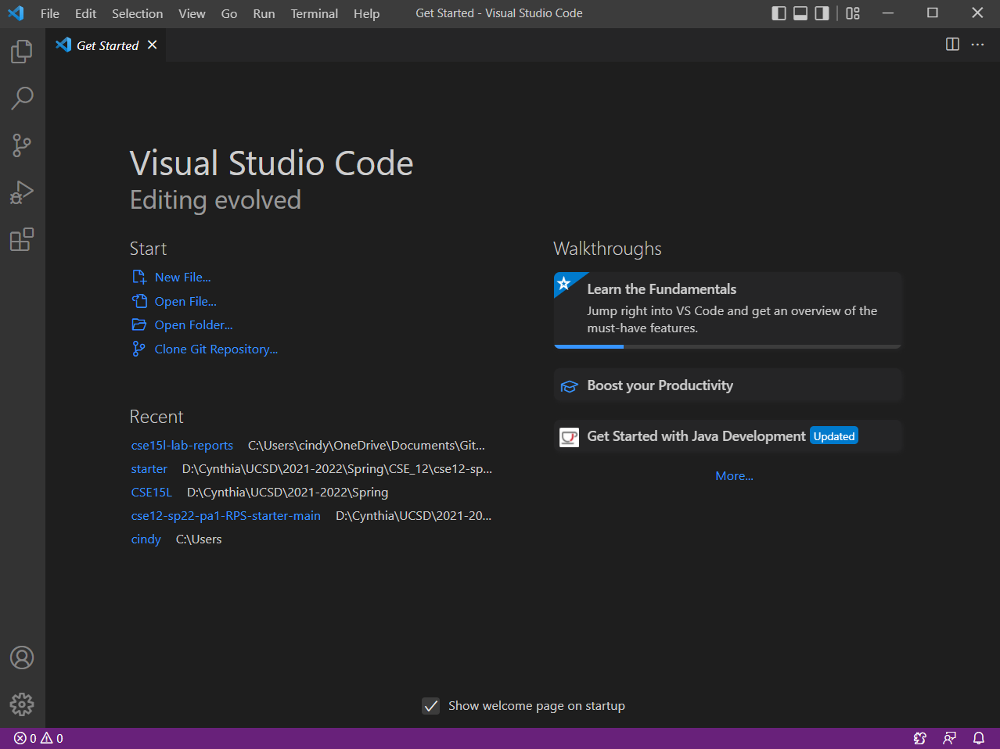
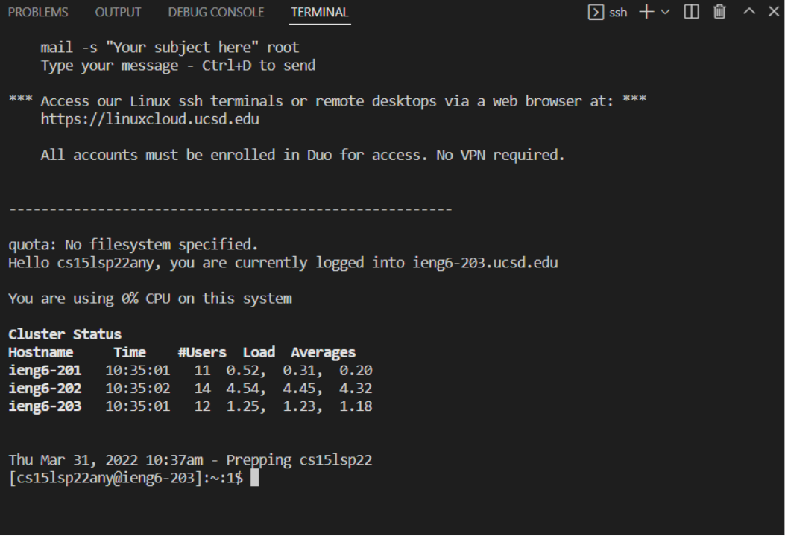
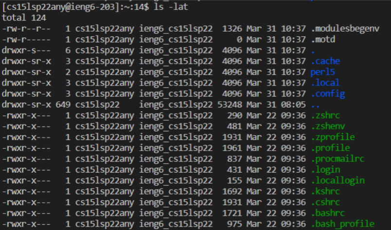
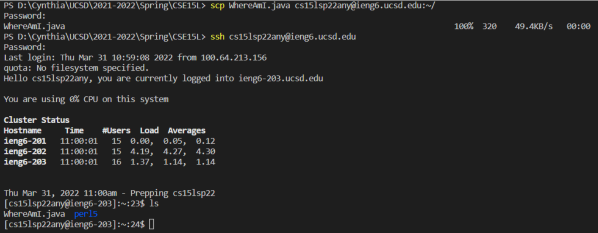
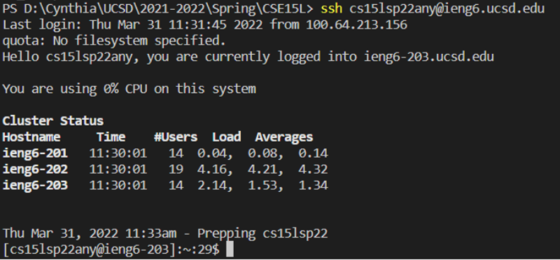
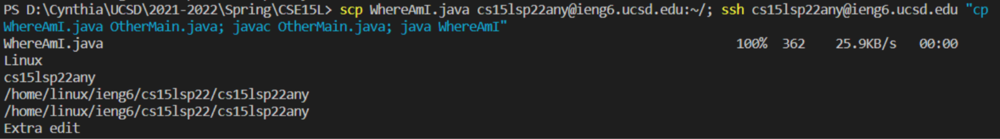

# Week 2 Lab Report - ieng6 Login Tutorial

## Installing Visual Studio Code

1. Go to [VSC website](https://code.visualstudio.com/) and download VSC for your device
2. Run the executable file, save it to your library
3. Open up VSC, you should get an application that looks like this:


## Remotely Connecting
1. Go to [this website](https://sdacs.ucsd.edu/~icc/index.php) to look up your course specific account - you may need to reset your password if this is your first time logging in
2. In VSC, click 'Terminal' then in the dropdown menu, click 'New Terminal'
3. In the terminal, type:

```
ssh cs15lsp22zz@ieng6.ucsd.edu
```
> The first part stands for CSE 15L, the second part is the quarter (sp22), and the letters (zz) will be replaced by your own unique set of letters. Replace these parts of the username (now and in future steps) as necessary.

4. Hit the enter key. If it poses a question about connecting, type yes, then hit the enter key. Type in your password (security feature makes it seem invisible), then hit enter.
5. Your terminal is now connected to the server! Your end result should look like:


## Trying Some Commands
- Both on your personal computer and on the server, try these commands:

```
cd ~
- change directory to home directory

cd <SomeDirectory>
- change directory to stated directory

ls -lat
- ls is list (lists files), -l is long (gives information about all the files), -a is hidden (shows hidden files), -t is time (orders by time created)

cp <SomeFile(Path)>
- copy file (within same server)
scp <file> cs15lsp22zz@ieng6.ucsd.edu
- copies file to different server (server indicated after file)

cat <SomeFile(Path)>
- reads data from file and gives content as output
```

- Example of running `ls -lat`:


## Moving Files with scp
- If you have a file you want to move
  - `cd` to the folder your file is in
  - `scp <Filename>.java cs15lsp22zz@ieng6.ucsd.edu:~/`
  - Type in the password and hit enter
- If you log back in to `ssh`, and enter the command `ls`, you file will appear in the list
  - You can run your file on the server using javac <Filename>.java and java <SomeClass>
- Example:


## Setting an SSH Key
- On your computer (the client) type: `ssh-keygen`
- This should appear:

```
Generating public/private rsa key pair.
Enter file in which to save the key (/Users/<user-name>/.ssh/id_rsa):
```
- Copy whatever folder appears in the parenthesis and paste it after the colon, then hit enter

```
Enter passphrase (empty for no passphrase): 
Enter same passphrase again: 
```
- We don’t need a passphrase, so hit enter twice
- This should appear:

```
Your identification has been saved in /Users/<user-name>/.ssh/id_rsa.

Your public key has been saved in /Users/<user-name>/.ssh/id_rsa.pub.

The key fingerprint is:

```

- Below this should be a key and a randomart image

- If on Windows:
- Type:

```
ssh-keygen -t ed25519
ssh cs15lsp22zz@ieng6.ucsd.edu
```
- Enter your password, then type:

```
mkdir .ssh
exit
```
- (exit is to logout of the server)
- On the client, type (filling in blanks with your own information):

``` 
scp /Users/<user-name>/.ssh/id_rsa.pub cs15lsp22zz@ieng6.ucsd.edu:~/.ssh/authorized_keys
```
- You should be able to log in without a password after this:


## Optimizing Remote Running
- You can put commands inside of "" to run it directly on the server and exit the server in one line! For example:

```
ssh cs15lsp22zz@ieng6.ucsd.edu "ls lat"
```
- You can also write multiple commands on the same line by using the semicolon. For example:

```
javac <Filename>.java; java ClassName
```
- You can also combine these two together. For example, to copy a file from your local directory to the server, then create a copy of that file and run it on the server in one line:

```
scp <FileName>.java cs15lsp22zz@ieng6.ucsd.edu:~/; ssh cs15lsp22zz@ieng6.ucsd.edu "cp <Filename>.java <FileName2>.java; javac <Filename2>.java; java FileName2"
```
- Here's an example to showcase this line of code:

