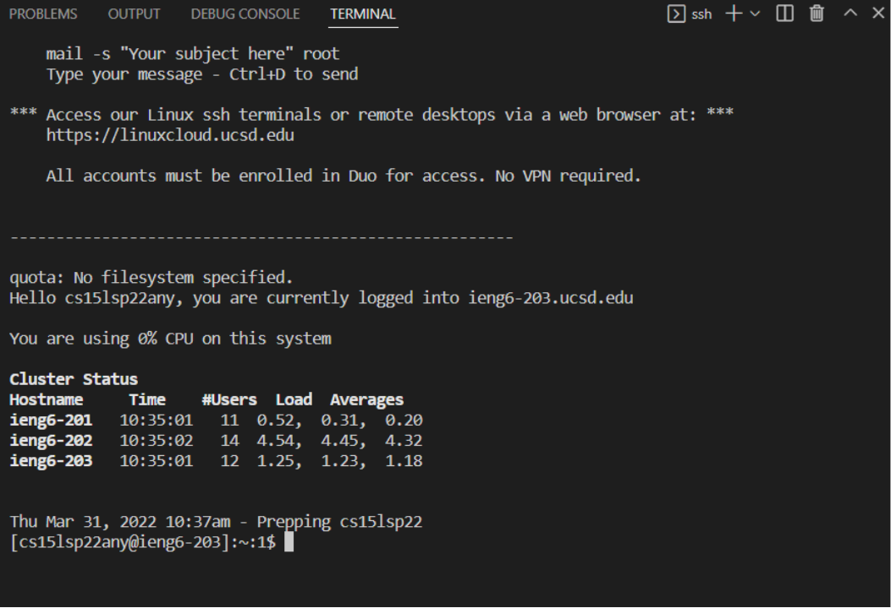

# Week 2 Lab Report - ieng6 Login Tutorial

## Installing Visual Studio Code

1. Go to [VSC website](https://code.visualstudio.com/) and download VSC for your device
2. Run the executable file, save it to your library
3. Open up VSC, you should get an application that looks like this:


## Remotely Connecting
1. Go to [this website](https://sdacs.ucsd.edu/~icc/index.php) to look up your course specific account - you may need to reset your password if this is your first time logging in
2. In VSC, click 'Terminal' then in the dropdown menu, click 'New Terminal'
3. In the terminal, type:
```
ssh cs15lsp22zz@ieng6.ucsd.edu
```
> The first part stands for CSE 15L, the second part is the quarter (sp22), and the letters (zz) will be replaced by your own unique set of letters.

4. Hit the enter key. If it poses a question about connecting, type yes, then hit the enter key. Type in your password (security feature makes it seem invisible), then hit enter.
5. Your terminal is now connected to the server! Your end result should look like:


## Trying Some Commands
- Both on your personal computer and on the server, try these commands:
```
cd ~
- change directory to home directory

cd <SomeDirectory>
- change directory to stated directory

ls -lat
- ls is list (lists files), -l is long (gives information about all the files), -a is hidden (shows hidden files), -t is time (orders by time created)

cp <SomeFile(Path)>
- copy file (within same server)
scp <file> cs15lsp22zz@ieng6.ucsd.edu
- copies file to different server (server indicated after file)

cat <SomeFile(Path)>
- reads data from file and gives content as output
```

Example of running `ls -lat`:


## Moving Files with scp
