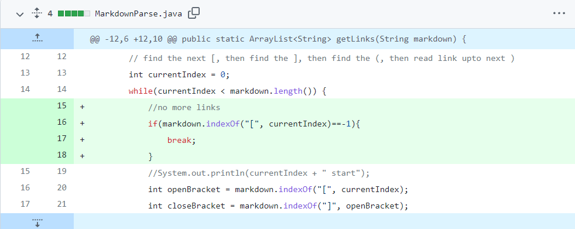
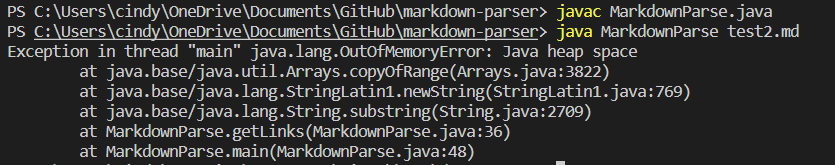
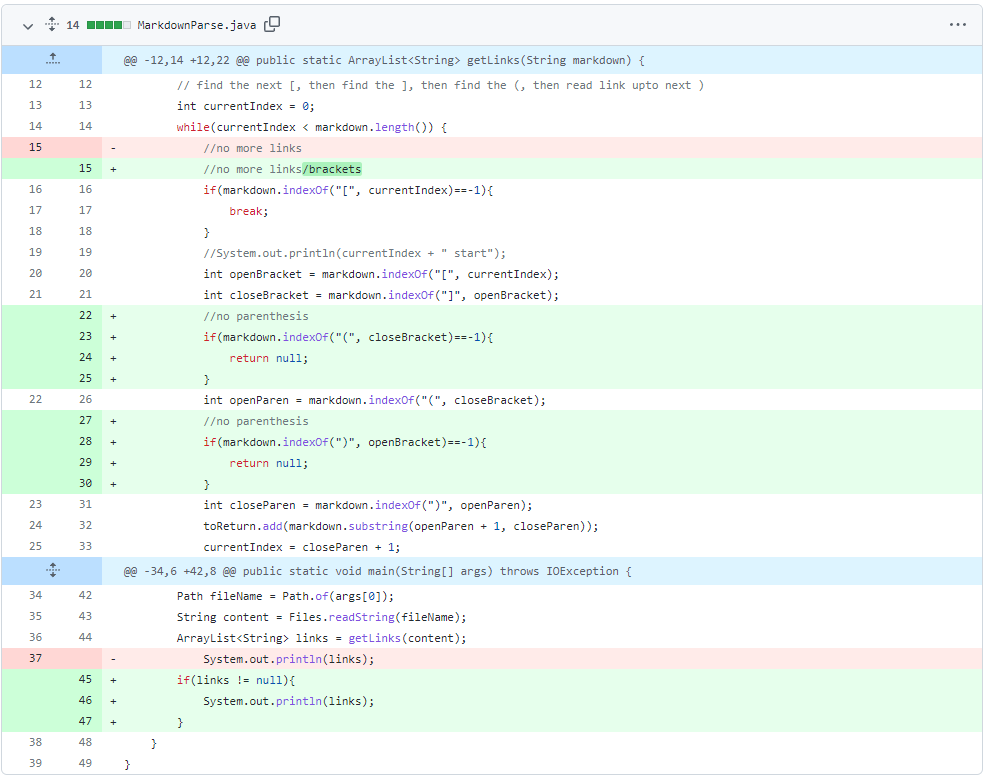
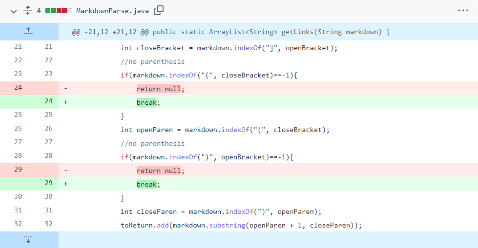
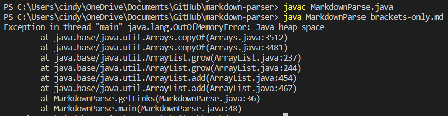
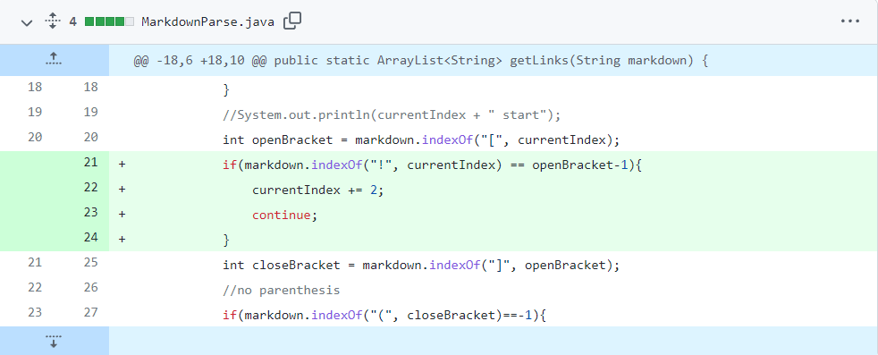
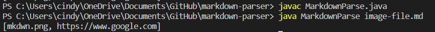

# Week 4 Lab Report - 3 Bug Fixes

## Bug 1

- The symptom appeared in the terminal when I attempted to run the file that had extra lines after a link, and there was a runtime error. This told me that the bug was in the while loop, and that the loop would run on infinitely. To fix this, I broke the loop when there were no more links.

- Here are the changes made to fix the bug: 

- Here is a
[link to the failure-inducing input](https://github.com/cynthia-bao/markdown-parser/blob/9d3f4e75be5065f991e9637208c192c4aabd198c/test2.md)

- Here is an image of the symptoms shown: 

## Bug 2
- The symptom appeared in the terminal when I attempted to run the file that had a pair of brackets with no parenthesis, and gave a runtime error. This meant that the while loop ran infinitely when it couldn't find a pair of parenthesis. To fix this, I broke the while loop when another set of parenthesis couldn't be found.

- Here are the changes made to fix the bug:

- Here is a [link to the failure-inducing input](https://github.com/cynthia-bao/markdown-parser/blob/9d3f4e75be5065f991e9637208c192c4aabd198c/brackets-only.md)

- Here is an image of the symptoms shown: 

## Bug 3
- The symptom appeared in the terminal when I attempted to run the file that had an image file in it. However, the markdown parser read the image as a link, which is not desired. To fix it, an exclamation point '!' was scanned for to make sure it's a link and not an image.

- Here are the changes made to fix the bug:

- Here is a [link to the failure-inducing input](https://github.com/cynthia-bao/markdown-parser/blob/9d3f4e75be5065f991e9637208c192c4aabd198c/image-file.md)

- Here is an image of the symptoms shown: 
