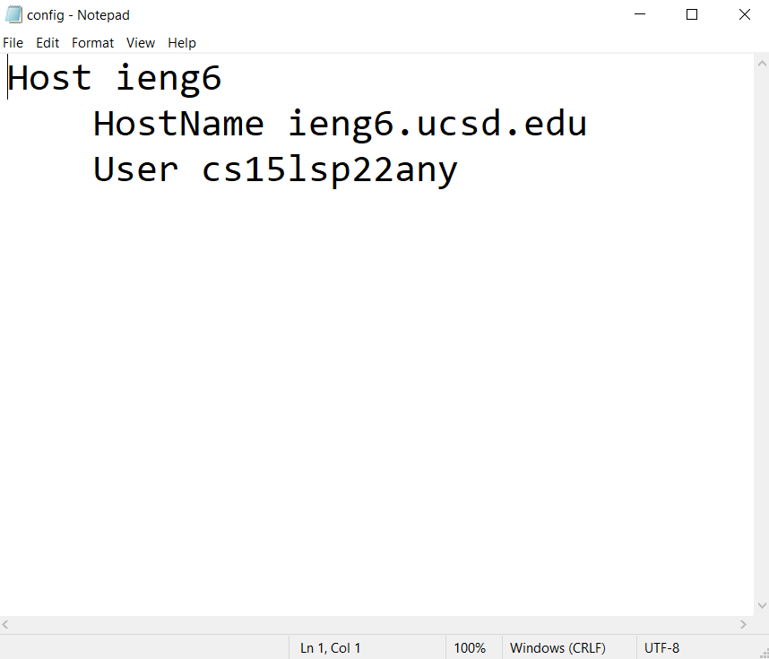
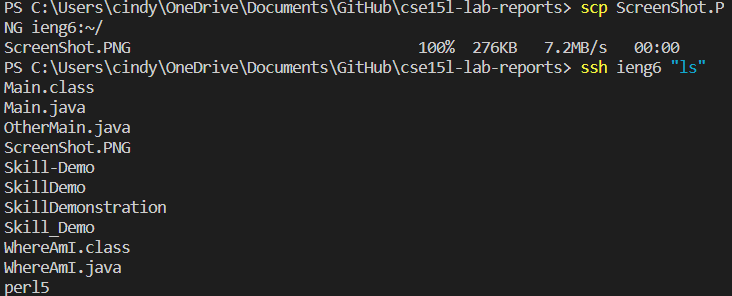
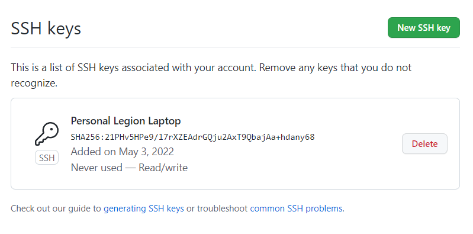
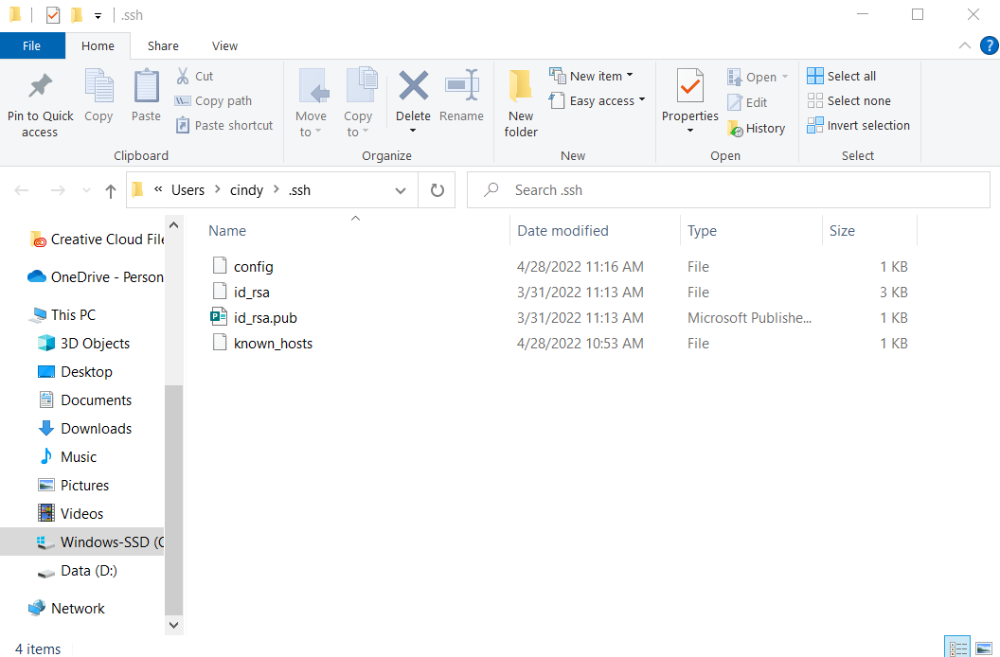
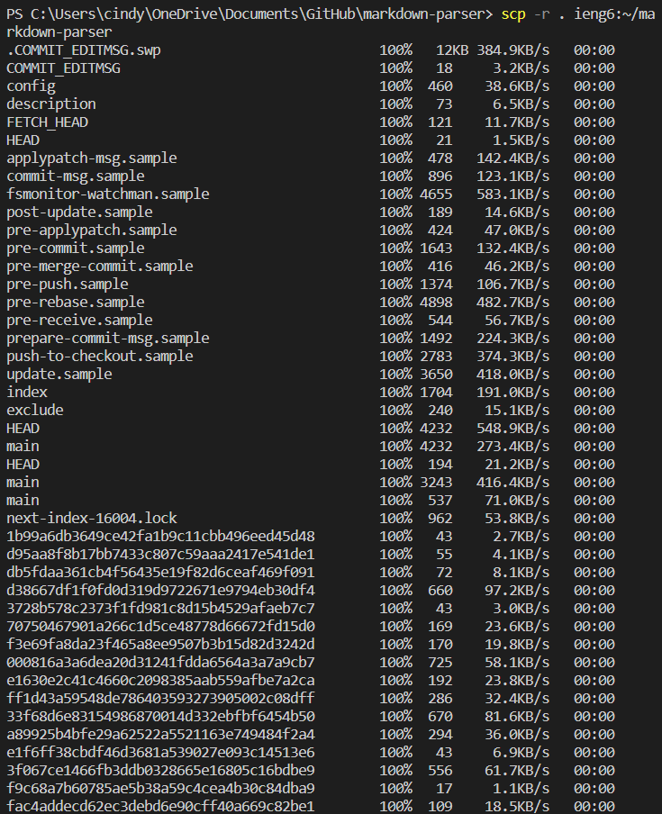
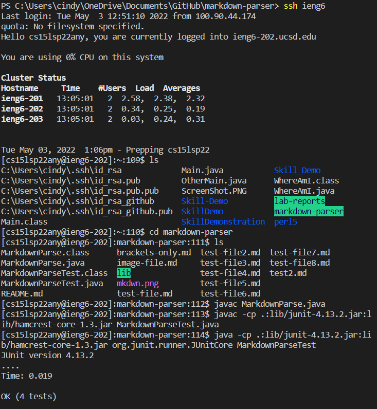

# Streamlining ssh Configuration

In order to make logging in easier, we can make it so that we only need to type in a short username (of our choice). To do this, we need the key for our local device and server, so that the server knows it's us.

- .ssh/config file was edited using text editor program (Notepad), then delete the .txt (so it's no longer a text file)



- ssh command to log into account using alias: ieng6


- scp command copying a file to your account using just alias you chose: copying a file 



# Setup Github Access from ieng6

In order to directly push changes into the github repositories, we need a key (public and private). We can do this for both our own local device, as well as our server specific account.

- public key stored in Github



- private key stored on user account



- git commands to commit and push a change to github while logged into ieng6 account


# Copying Whole Directories with scp-r

`scp -r` allows you to recursively copy directories into other servers, meaning it copies all of the directory's folders and files. By listing a directory and location after `scp -r`, we can copy that directory and its contents to the listed location!

- copying whole markdown-parser directory into ieng6 account using 

```
scp -r . ieng6:markdownparse
```



- compiling and running tests for repository after logging into your ieng6 account



- Command combining scp, ;, and ssh to copy whole directory and run the tests on one line:
```
scp -r *.java *.md lib/ ieng6:markdownparse; ssh ieng6 "cd markdownparse; javac MarkdownParse.java; javac -cp .:lib/junit-4.13.2.jar:lib/hamcrest-core-1.3.jar MarkdownParseTest.java; java -cp .:lib/junit-4.13.2.jar:lib/hamcrest-core-1.3.jar org.junit.runner.JUnitCore MarkdownParseTest"
```