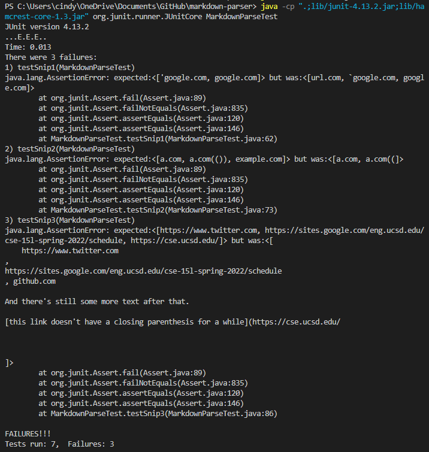

# Lab Report 4 Week 8 - Markdown Testing

Here are the links to [my implementation](https://github.com/cynthia-bao/markdown-parser) and the [reviewed implementation](https://github.com/Wei-Ji-Chen/markdown-parser).

## Snippets and Expected Output
Using VSCode preview for each of the snippets:

For snippet 1:

```
`[a link`](url.com)

[another link](`google.com)`

[`cod[e`](google.com)

[`code]`](ucsd.edu)
```

- the expected output is `['google.com, google.com]`

For snippet 2:

```
[a [nested link](a.com)](b.com)

[a nested parenthesized url](a.com(()))

[some escaped \[ brackets \]](example.com)
```

- the expected output is `[a.com, a.com(()), example.com]`

For snippet 3:

```
[this title text is really long and takes up more than 
one line

and has some line breaks](
    https://www.twitter.com
)

[this title text is really long and takes up more than 
one line](
https://sites.google.com/eng.ucsd.edu/cse-15l-spring-2022/schedule
)


[this link doesn't have a closing parenthesis](github.com

And there's still some more text after that.

[this link doesn't have a closing parenthesis for a while](https://cse.ucsd.edu/


)

And then there's more text
```

- the expected output is `[https://sites.google.com/eng.ucsd.edu/cse-15l-spring-2022/schedule, https://cse.ucsd.edu/]`

## Tests Created from Snippets
To test the markdown snippets, I created three new .md files containing the content in each of the three snippets. Below are the tests used for both my implementation and the reviewed implementation:


## My Output + Possible Changes

Here was the result of the tests on my implementation of markdown-parser:



- For snippet 1 and for all related cases using inline code with backticks, we can use ```String.indexOf("`")``` and find pairs of backticks. Anything between those pairs of backticks would be considered code, and brackets/parenthesis between the backticks would not be considered to be part of the link (anything between index of the two backticks).
- For snippet 2 and all related cases that nest parentheses, brackets, and escaped brackets, there might require a bit of a more involved code change. Since nested and escaped brackets and parentheses would require pairs, we could try making it such that the code would look between the sets of paired brackets and parenthesis for more of the same starting characters, and if more exist, then they would look for more closing characters to pair together, and the outside sets would be considered the link brackets/parenthesis.
- For snippet 3 and all related cases that have newlines in brackets and parentheses, we can first delete line breaks when adding the link to the list of links. If there's also a full set of brackets or parenthesis for a link after there's a set of unclosed brackets/parenthesis (and not all sets are closed sets of characters) we know that the content in the unclosed set of characters are not a valid link. There might be a simple way to implement this, but this might also take code that is a little more involved.

## Reviewed Implementation

I created the same tests on the MarkdownParseTest.java file on the reviewed repository of markdown-parser. Test 1 passed using the reviewed repository's implementation. However, testing snippets 2 and 3 failed, so here are the results of running tests for snip 2 and 3:

