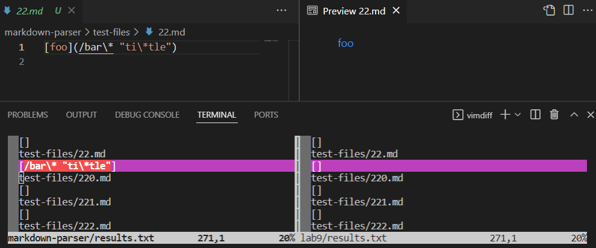
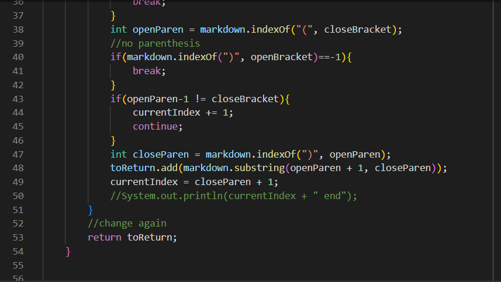
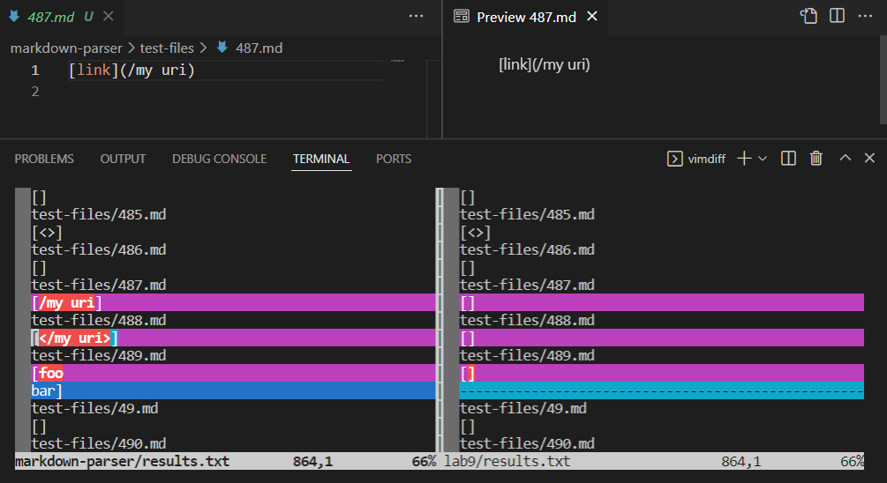

# Lab Report 5 Week 10 - Comparing Markdown Parse Test Results

To find tests with different results, I used the vimdiff command below to create two lists of test results for each of the markdown parser implementations. `markdown-parser` refers to my implementation of markdown parser, while `lab9` is the given version of markdown parser.
```
vimdiff markdown-parser/results.txt lab9/results.txt
```

The two results chosen are the results for [test 22](https://github.com/nidhidhamnani/markdown-parser/blob/main/test-files/22.md) and the results for [test 487](https://github.com/nidhidhamnani/markdown-parser/blob/main/test-files/487.md).

## Test 22
Below are the results for test 22, as well as the expected result as shown through the VSCode Preview:



- Neither implementation provides the correct output.
- The expected output is `[ti*tle]`.
- For my implementation, the bug is that when there are quotations within the parenthesis, the link should only be what is between the quotes. Additionally, backslashes (`\`) should not be included in the link.
- After line 47 (see image below), before adding the link, we should check if there is a backslash and make sure to remove it from the string, as well as check if there are double quotes, and remove items outside of the double quotes from the link string.




## Test 487
Below are the results for test 487, as well as the expected result as shown through the VSCode Preview:



- The given implementation in lab 9 provides the correct result.
- The expected output is `[]` (no link).
- For my implementation, the bug is that if there is a front slash, then the entire link should not be valid. However, my code recognizes the entire `/my uri` as a valid link.
- After line 47 (see image below), I should check if the link contains a front slash, and if it does, I shouldn't add to the list of links. However, I should check this before checking for quotes (see test 22 bug), because the moment there is a front slash in the parenthesis, the entire link is invalid.

